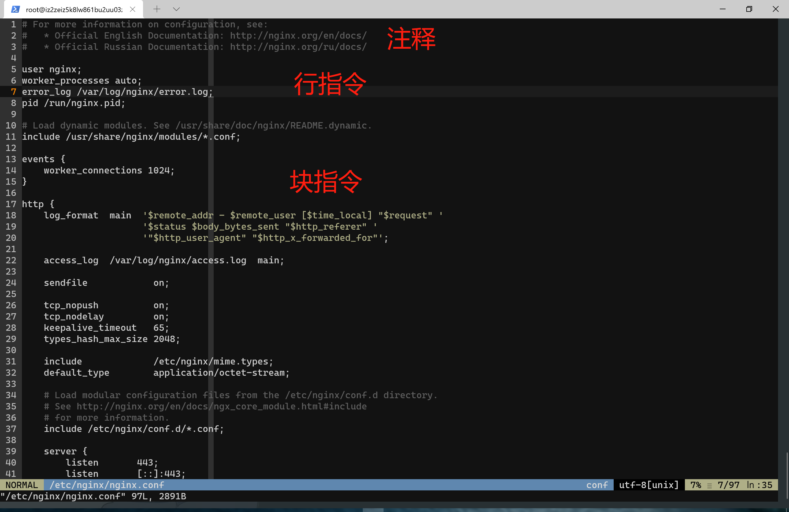

# 网站搭建初级教程

2021 年 8 月 16 日 初雨墨

## 准备工作

1. 构建好的 web 应用
   - 前端 (React - npm run build)
   - 后端 (Flask)
2. 服务器 (CentOS 7.3)
3. SSL 证书 (Let's Encrypt)
4. Web Server (Nginx)

## 上传代码

### Windows

```powershell
usage: scp [-346BCpqrTv] [-c cipher] [-F ssh_config] [-i identity_file]
            [-J destination] [-l limit] [-o ssh_option] [-P port]
            [-S program] source ... target
```

### Linux

```shell
usage: scp [-12346BCpqrv] [-c cipher] [-F ssh_config] [-i identity_file]
           [-l limit] [-o ssh_option] [-P port] [-S program]
           [[user@]host1:]file1 ... [[user@]host2:]file2
```

使用指令 `man scp` 查看用户手册

## 配置服务器

### 1. 启动 Nginx

```shell
/usr/local/nginx
```

### 2. 修改 Nginx 配置

配置文件通常存放在 `/etc/nginx/nginx.conf`



### 3. 提供静态文件服务

#### 路径

HTML - `/data/www`
图片 - `/data/images`

#### Nginx 设置

使用 Nginx 作为 Web 服务器，需要在配置文件中添加 http 块和 server 块。

```nginx
http {
    server {
    }
}
```

可以在配置文件中添加多个 server 块，用域名和端口号来区分。Nginx 会根据请求来判断匹配哪一个 server 块，并根据这个 server 块的 location 配置来提供服务。

接下来添加 location 块，用来指定 URI

```nginx
http {
    server {
        location / {
            root /data/www;
        }

        location /images/ {
            root /data;
        }
    }
}
```

location 块会指定一个前缀来匹配请求 URI (`/`, `/images/`)，如果匹配成功，URI 会添加上 root 指令指定的路径作为前缀，拼接后的路径会成为请求的文件的路径。如果一个请求匹配了多个 location 块，Nginx 会选择最长的前缀。因为我们提供了一个最短的路径 `/`，一旦其他的 location 匹配全部失败，就会使用这个 location 来处理。

例如，请求 `/index.html`，会匹配第一个 location，于是 Nginx 会返回文件系统上 `/data/www/index.html`。

如果一个请求没有匹配到 location，Nginx 会返回一个默认的 404 页面。

### 4. 提供请求转发

#### 启动后端服务

```shell
gunicorn Server:create_app() -b 127.0.0.1:8000
```

现在添加一个 location 将请求转发到 `/api/`

```nginx
server {
    # ...
    location /api/ {
        proxy_pass http://localhost:8000;
        proxy_set_header Host $host;
        proxy_set_header X-Forwarded-For $proxy_add_x_forwarded_for;
    }
}
```

现在，只需要访问 `http://localhost/api/`，就可以访问到后端的 API。

### 5. 配置 SSL 证书 (可选)

#### 获取证书

1. Let's Encrypt
2. 阿里云

#### 证书目录

在 `/cert/` 目录下存放有 `5560127_www.kaixa.cn.pem` 和 `5560127_www.kaixa.cn.key` 文件

#### Nginx 设置

```nginx
server {
    # ...
    listen       443;
    listen       [::]:443;
    ssl on;
    ssl_certificate /cert/5560127_www.kaixa.cn.pem;
    ssl_certificate_key /cert/5560127_www.kaixa.cn.key;
    ssl_session_timeout 5m;
    ssl_ciphers     ECDHE-RSA-AES128-GCM-SHA256:ECDHE:ECDH:AES:HIGH:!NUL    L:!aNULL:!MD5:!ADH:!RC4;
    ssl_protocols TLSv1 TLSv1.1 TLSv1.2;
    ssl_prefer_server_ciphers on;
}

```

## 参考

1. [Nginx - Beginner's Guide](http://nginx.org/en/docs/beginners_guide.html)
