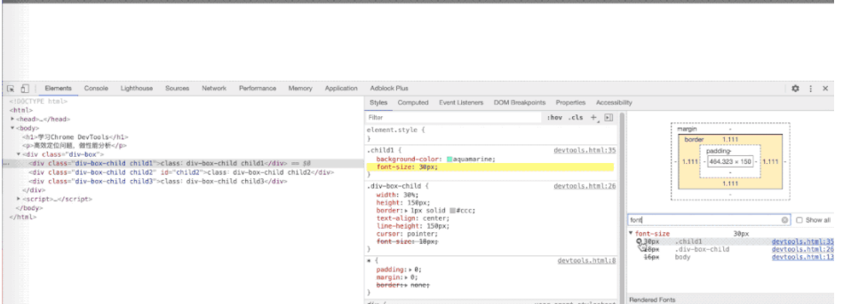

# Chrome DevTools使用技巧

2021年8月23日  黄显鹏

## 一.Chrome DevTools 功能简介

（九大功能面板）

#### （1）Elements元素面板

​        检查和调整页面，调试DOM,调试CSS

#### （2）Network网络面板

​         调试请求，了解页面静态资源分布，网页性能检测

#### （3）Console控制台面板

​         调试javascript,查看console log日志，交互式代码调试

#### （4）Sources源代码资源面板

​          调试JavaScript页面源代码，进行断点调试代码

#### （5）Application应用面板

​            查看&调试客户端存储，如Cookie,LocalStorage,SessionStorage等

#### （6）Performance性能面板

​            查看页面性能细节，细粒度对网页载入进行性能优化（高阶)

#### （7）Memory内存面板

​             JavaScript CPU分析器，内存堆分析器（高阶)

#### （8）Security安全面板

​            查看页面安全及证书问题（高阶)

#### （9）Lighthouse(Audits)面板

​            使用Google Lighthouse辅助性能分析，给出优化建议（高阶)


## 二.Chrome DevTools 使用技巧

### 1.有关css方面

####   (1)样式定位到CSS

项目DOM层级是比较复杂（深），例如`font-size`这一样式属性，就可能存在多层覆盖，我们必须定位到最终表现生效的CSS，才能做出有效修改。

1. 在`Computed`面板中的`filter`输入框筛选样式属性名
2. 展开属性，看到多处定义，且只有第一行生效
3. 鼠标hover时，左侧显示`->`，点击可跳转到`Styles`面板中的CSS规则
4. 可在生效的CSS规则中修改样式



####   (2)颜色选择器

​     在调试CSS中，设置颜色相关属性的值，可以通过Chrome提供的颜色选择器，动态修改颜色。

1. 找到CSS中设置颜色的属性
2. 点击颜色值左侧的选择器（彩色方块）


#### (3)阴影选择器

阴影选择器用于`box-shadow`属性，可以直接通过选择器可视化调整。

1. 点击`box-shadow`属性右侧的“层叠偏移图标”，弹出阴影选择器
2. 通过颜色选择器面板可设置横纵轴偏移量、阴影模糊度和扩散度、内外阴影


#### (4)CSS属性值快速调整

鼠标滚轮可以实现css属性值的微调或快速调整，比如字体大小、旋转角度、宽高数值等 鼠标滚轮不只是+-1

1. +-0.1：`Option`+鼠标滚轮，windows系统是`Alt`+滚轮
2. +-1：滚轮前后滚动
3. +-10：`Shift`+鼠标滚轮
4. +-100：`Command`+鼠标滚轮，Windows系统是`Ctrl`+滚轮

#### (5)animation动画调试

某些元素动画效果可以通过“帧动画”、`transition`实现，开发实现过程中的代码过于抽象，实际上还是得在浏览器中查看效果。Chrome开发工具提供了针对animation的调试面板。该面板可提供动画重播、暂停、预览、修改 操作方法：

1. 打开控制台，键盘按“ESC”，调出Console面板
2. 点击Console面板左上角“竖三点”，弹出菜单选择“Animations”，即可打开动画调试面板


在动画面板可以看到帧动画的名称和对应DOM节点，点击第一列的DOM节点，可以快速定位到Elements面板中DOM所在位置，同时Styles面板也会更新，可滚动Styles面板到底部即可看到已定义的“帧动画” 动画面板的作用：

- 定位动画作用的DOM结构
- 控制动画执行过程：播放、暂停、重播、减速动画、控制执行时间
- 预览动画执行过程、动画时间曲线
- 侦听记录所有动画过程

## **2. 模拟网速和禁止缓存**


Online里面的选项：

- Fast 3G，模拟很快的3G网络
- Slow 3G，模拟很慢的3G网络
- Offline，模拟断网的情况

这个也可以自己调节，在DevTools 中的网络选项卡中，可以看到每个功能、操作或文件加载需要多长时间。也可以使用网络选项卡来模拟缓慢的网络连接，使用 `Network Throttling` 就可以做到这点。


添加和选择这个配置文件后，剩下要做的就是刷新页面，看看它在糟糕的网络连接下的表现。


## 3.使用设计模式

另一个 CSS 和设计技巧是使用设计模式直接编辑网站上的内容，不需要修改 HTML 和 CSS 源文件，只需点击/高亮页面上的内容，就可以修改它。要开启这个模式，只需在控制台中输入 `document.designMode = "on"`或者 `document.body.contentEditable = "true"`即可。


## 4.用预置或自定义地址重写地理位置

JavaScript 可以这样获取你的地理位置：

```
navigator.geolocation.getCurrentPosition(console.log)
```

在 Chrome DevTools 的 Sensors 面板中，你可以用预置的或者自己定义的地址重写经纬度。该功能可以用来调试使用地理位置的页面。操作如下：

- 打开 `Sensor` 面板（如图操作或快捷键 `Ctrl Shift P` 输入 `sensor` 回车）
- 选择一个预置地址或点击 `Manage` 自定义新的地址（地名，经纬度）
- 在 `Console` 面板下输入 `navigator.geolocation.getCurrentPosition(console.log)` 观察地址变化。


## 5.从 Console Violations 获取性能建议

Console Violations 会给你提示针对你代码的最佳实践。使用该功能的好处就是，不需要去运行 `Performance`  ，因为违规代码执行的时候就会显示相应的Violations，如强制回流的 JavaScript，使用了 `document.write` 的 JavaScript，执行缓慢的 `setTimeout `处理程序，效率低下的时间侦听器等等 。操作如下：

- 在 `Console` 面板中点击 `Default levels` 下拉框，选择 `Verbose`
- 在过滤框中输入` violation`


## 6.代码覆盖率检测

项目时间久了，会有很多冗余代码是从来不会执行的，或是需要做首屏加载优化，想把首屏用不到的js和css 代码抽取出来做异步加载，使用chrome自带的coverage检测工具可以很方便的看到哪些代码被执行了，红色表示未被执行的代码。做首屏优化时可以抽取出来做异步加载，如果你把所有的用例都跑完了，这行代码还是红色的，则可以从容的删除这些红色的代码。

code coverage面板默认是不显示的，需要在more tools 菜单中打开


### 7.**Console**的理解

当Debug的时候，咱们绝大部分时间是在和Console打交道。咱们每每在代码中插入不少Console log()，经过打印变量值来debug。鉴于Console对于咱们这么重要，颇有必要了解全部开发者工具提供的相关的APIs和快捷键。

**(1). 打印对象**

在使用`console.log();的时候，不只仅打印变量，而是要打印对象，用大括号(`{}`)将变量包围起来。这样的优势是不只会把变量的值打印，同时还会将变量名打印出来。


 **(2)使用console.table来打印多条目数据**

要打印的变量是一个数组，每个元素都是一个对象。使用`console.table`来打印，其表格化的呈现更加美观易读。


**(3)给log加点颜色**

log有时候变得很是多，包含你本身的、一些第三方扩展或者浏览器的logs。除了使用过滤器(filter)之外，你还可使用颜色来更好地区分。

- `console.log`
- `console.info`
- `console.debug`
- `console.warn`
- `console.error`

可以自定义自己的日志样式，例如：

```js
console.log('%cconsole.log', 'color: green;'); 
console.info('%cconsole.info', 'color: green;'); 
console.debug('%cconsole.debug', 'color: green;'); 
console.warn('%cconsole.warn', 'color: green;'); 
console.error('%cconsole.error', 'color: green;'); 
```

```js
console.log(
  'Nothing here %cHi Cat %cHey Bear',  // Console Message
  'color: blue', 'color: red' // CSS Style
);
```

[](https://blog.fundebug.com/2018/08/22/art-of-debugging-with-chrome-devtools/logcolor.png)


**(4)计时功能**

使用`Console.time()`和`Console.timeEnd()`包裹需要计时的代码片段，输出运行这段代码的事件。

- `Console.time()`中的参数作为计时器的标识，具有唯一性。
- `Console.timeEnd()`中的参数来结束此标识的计时器，并以毫秒为单位返回运行时间。
- 最多同时运行10000个计时器。

```javascript
console.time("Chrome中循环1000次的时间");
for(var i = 0; i < 1000; i++)
{

}
console.timeEnd("Chrome中循环1000次的时间");
```


**(5)性能分析**

使用`Console.profile()`进行性能分析，查看代码各部分运行消耗的时间，在Chrome自带的调试工具中并没有找到在哪里查看这两个方法生成的分析报告。应该需要其他的调试工具。

具体参考这里：
[http://www.oschina.net/transl...](https://link.segmentfault.com/?url=http%3A%2F%2Fwww.oschina.net%2Ftranslate%2Fperformance-optimisation-with-timeline-profiles)