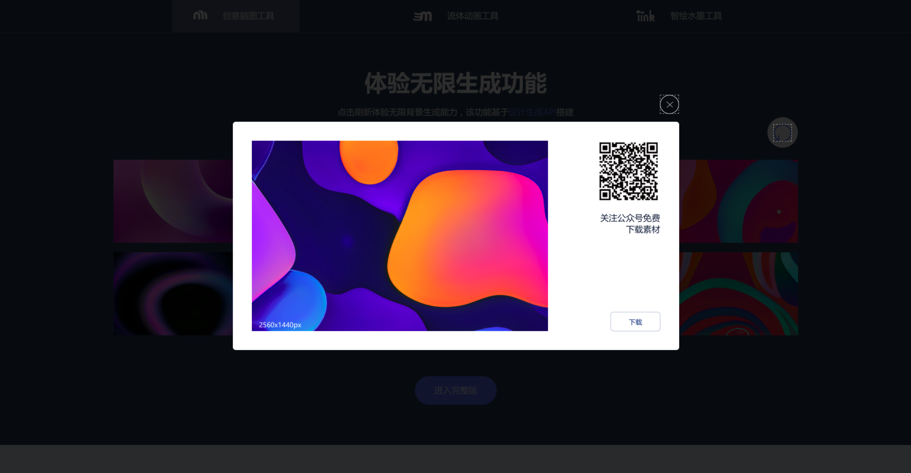
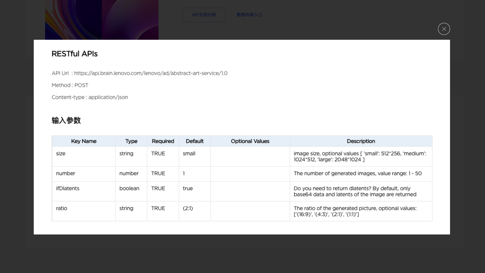
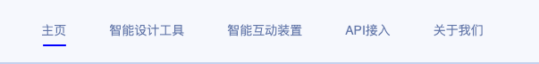
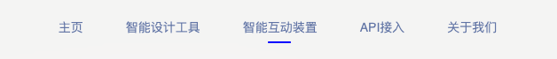

# 小绘官网中的设计需求案例 1

2021 年 8 月 30 日 李金星

> 小绘官网技术栈为`Vue3`+`Typescript`， 以下案例也基于该技术栈实现。

## 1 封装自定义弹窗组件

### 设计需求





### 实现思路

在页面 dom 树的根结点插入一个新节点，该节点具有以下特性：

- 展示内容在页面固定 始终位于页面中心
- 背景为半透明的黑色 底层元素可见
- 层级较高 浮于原有界面的任何元素之上

### 实现方法

- [x] 页面 dom 树的根结点插入一个新节点 基于[Teleport](https://v3.vuejs.org/guide/teleport.html#teleport)实现

  > Vue3 | Teleport
  >
  > Teleport provides a clean way to allow us to control under which parent in our DOM we want a piece of HTML to be rendered, without having to resort to global state or splitting this into two components.

  ```html
  <teleport to="body"> /* your core component */ </teleport>
  ```

- [x] 节点的三点特性较为简单 基于`css`实现

  ```scss
  .modal-wrapper {
    /* 基于绝对定位 实现可视窗口内的全屏 并固定节点位置 (即使用户滚动窗口 节点依然位于可视窗口中心) */
    position: fixed;
    top: 0;
    right: 0;
    bottom: 0;
    left: 0;

    /* 使用带透明度属性的background/rgba 实现蒙版效果 */
    background: rgba(255, 255, 255, 0.8);

    /* 层级高于兄弟节点层级即可 */
    z-index: 10;
  }
  ```

## 2 导航栏动画

### [设计需求](https://cloud.protopie.io/p/60bf5bb97b)

导航栏底部有细条指示当前页面索引，点击另一索引时，指示条滑动过去并伴随形变，形变方向与滑动方向相反。





### 实现思路

- 将指示条与索引列表的 dom 层级并列，单独一个 div，以便实现滑动效果
- 滑动距离基于绝对定位和动态更新的`left`实现；left 数值与新索引的位置`activeIndex`有关
- 滑动方向与形变方向相关，需监听导致滑动的`点击导航栏事件`，并计算更新指示条形变参考坐标点

### 一处难点

- animation 只受首次触发后更新，再次触发时不执行

### 实现方法

- dom 层

  > 主要基于[动态 class/style](https://vue3js.cn/docs/zh/guide/class-and-style.html#%E7%BB%91%E5%AE%9A-html-class)

  - [x] 滑动距离数值更新 -> 基于`activeIndex`，动态更新 class，每个 class 标识具体 left 值

  ```html
  <div class="list">
    <!-- first nav item ...-->
    <div
      class="item"
      @click="handleClickMenu(1, '/')"
      v-bind:class="{ active: true }"
    >
      <router-link to="/">主页</router-link>
    </div>
    <!-- other nav item ...-->

    <!-- tabline -->
    <div
      class="tabline"
      ref="tabline"
      :class="[
                 `tabline-index${tablineIndex}`, 
                 state.isAnimation ? `lengthAnimation` : '',
                 ]"
      :style="{ transformOrigin: state.transformDirection }"
      <!--
      动态绑定形变方向
      --
    >
      @animationend="animationRemove" >
    </div>
  </div>
  ```

- 逻辑层 vue+ts

  - [x] 滑动方向 -> 基于`activeIndex`监听，新旧值计算移动方向
  - [x] animation 只受首次触发后更新 -> 动画结束时去除该 class，点击导航栏事件时添加

  ```typescript
  const tabline = ref(null as HTMLDivElement | null);
  const tablineIndex = computed(() => {
    return state.activeIndex;
  });
  watch(
    () => state.activeIndex,
    (newVal, oldVal) => {
      if (newVal < oldVal) {
        state.transformDirection = "left";
      } else {
        state.transformDirection = "right";
      }
    }
  );
  // 点击导航栏事件
  const handleClickMenu = (index: number, route?: string): void => {
    state.isAnimation = true;
    state.activeIndex = index;
  };
  // 动画结束时
  const animationRemove = (e: any) => {
    state.isAnimation = false;
  };
  ```

- 样式层 scss

  ```scss
  .tabline {
    width: 26px;
    height: 2px;
    position: absolute;
    bottom: -8px;
    left: 24px;

    border-radius: 2px;
    background-color: blue;

    transition: all 0.4s cubic-bezier(0.4, 0, 0.2, 1);
  }

  @keyframes lenTrans {
    0% {
      transform: scaleX(1);
    }
    43% {
      transform: scaleX(2);
    }
    100% {
      transform: scaleX(1);
    }
  }

  .lengthAnimation {
    animation: 0.5s ease-in-out 0s forwards running lenTrans;
  }

  .tabline-index1 {
    left: 26px;
  }

  .tabline-index2 {
    left: 128px;
  }

  .tabline-index3 {
    left: 260px;
  }

  .tabline-index4 {
    left: 374px;
  }

  .tabline-index5 {
    left: 478px;
  }
  ```
