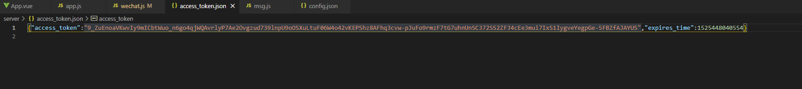

# 微信公众号开发

2021 年 9 月 6 日 黄显鹏

## 一、微信公众号的接入(三个部分)

### 1.node 服务器；

### 2.将本地的 node 服务暴露到外网；

​ [本项目所使用的外网映射软件(免费)](https://www.xiaomy.net/)

### 3.微信公众号信息验证

进入微信公众号的开发文档，选择开始开发，接口测试号申请。

当我们点提交的时候，微信服务器会给我们填写的 URL 地址发送一个 get 请求，并传回一些特定的字段。就是下图这些参数，我们需要把这些参数跟微信服务去验证。

设置完之后，可以诊断一下是否成功。

这里引入了一个新的模块 sha1，主要是对结果进行加密的。我们再到微信测试号配置设置就可以成功保存了，验证成功可以开始正式的开发了。

​ 微信授权验证方法

## 二、临时素材上传

对于与微信公众号，我们可能不仅仅只是发文本，我们还需要发语音，视频之类的各种素材。

从微信文档上可以看出，是 post 请求，然后传递文档流给微信服务器。

### (1)先配置好 config 文件。

​ config 文件

### (2)然后给 WeChat 添加一个素材上传的方法。

### (3)被动回复信息。

​ msg 文件

### 注：获取 access_token

​ access_token 文件

至此上传素材完成。素材上传的过程中主要有一点需要注意一下，post 请求的时候，需要给微信服务发送一个流文件，发送成功之后，服务器会返回一个 media_id。

这个 mdedia_id 就是该素材的 id,后面如果我们需要对素材进行其他操作，都是这个 id。
