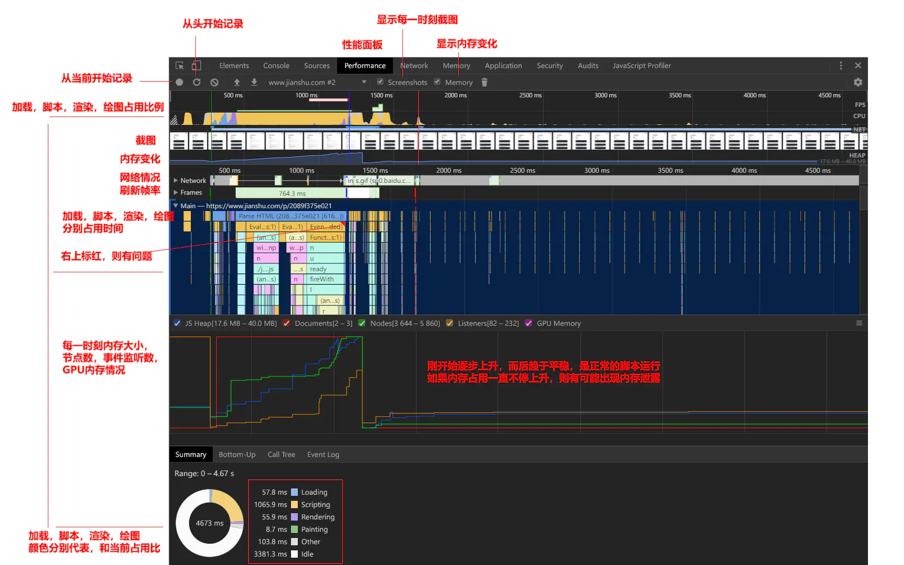
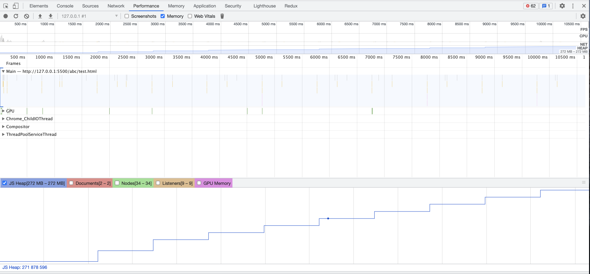
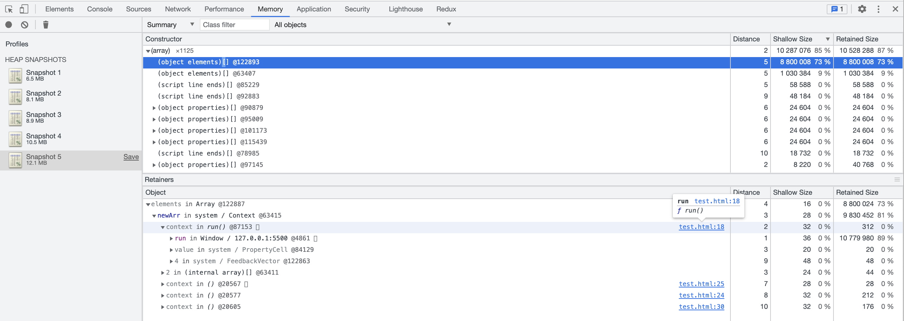
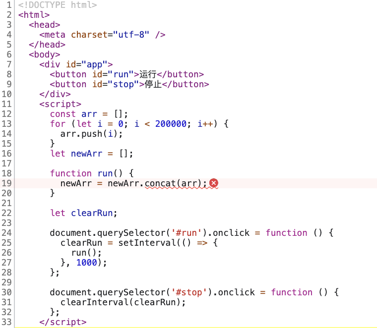

# JavaScript 内存泄漏

2021 年 9 月 13 日 徐千涵

## 1. 内存泄漏

- 内存泄露: 系统进程不再用到的内存，没有及时释放
- 只要程序提出要求，操作系统或者运行时就必须供给内存。对于持续运行的服务进程，必须及时释放不再用到的内存
- 当内存占用越来越高，轻则影响系统性能，重则导致进程崩溃
- Chrome 限制了浏览器所能使用的内存极限（64 位为 1.4GB，32 位为 1.0GB）
- 大多数语言提供自动内存管理，即垃圾回收机制

```jsx
let arr = [1, 2, 3];
console.log('hello world');
/* 若不重置arr接触引用, 则arr会持续占用内存*/
arr = null;
```

## 2. 垃圾回收机制

### 标记清除

- 标记阶段：从根集合出发，将所有活动对象及其子对象打上标记
- 清除阶段：遍历堆，将非活动对象（未打上标记）的连接到空闲链表上，释放所有非活动的内存块
- 优点：实现简单，易与其他算法组合
- 问题：出现内存碎片化， 会导致无数小分块散落在堆的各处

### 标记整理

- 在标记阶段后：将所有活动对象紧密的排在堆的一侧（压缩），移动完成后再清理掉边界外的全部内存
- 优点：不会出现内存碎片
- 问题：压缩过程开销大，需要多次搜索堆

### 引用计数

- 记录每个对象被引用的次数，每次新建对象、赋值引用和删除引用的同时更新计数器，如果计数器值为 0 则直接回收内存。
- 优点：暂停时间短
- 问题：计数器的增减处理繁重

## 3. 常见的内存泄露案例

### 意外的全局变量

- 在浏览器中，全局对象就是 window 对象。变量在窗口关闭或重新刷新页面之前都不会被释放，如果未声明的变量缓存大量的数据，就会导致内存泄露。

```jsx
function test() {
  /* 未声明变量: 在全局对象上创建该变量的引用 */
  x = new Array(1000);
}
/* test函数运行完后，数组x仍未被释放 */
test();
```

- 解决方案
  - 使用 ESLint，会自动报错
  - 使用严格模式，在 JavaScript 文件头部或者函数的顶部加上  `use strict`

### 定时器和回调函数

- 当不需要 `setInterval`或者 `setTimeout`时，若不及时清除，定时器的回调函数以及内部依赖的变量都不能被回收
- 解决方案
  - 使用对应的 clearInterval 进行及时清除

### 事件绑定

- 由于事件响应函数未及时移除，导致重复绑定，或者 DOM 元素已移除后，未处理事件响应函数造成。

```jsx
class Test extends React.Component {
  componentDidMount() {
    /* Test组件在挂载的时候监听了resize事件，但是在组件移除的时候没有处理相应函数,
				这样会在window上绑定很多无用的事件监听函数，导致内存泄漏。
			*/
    window.addEventListener('resize', function () {
      /* 相关操作 */
    });
  }

  render() {
    return <div>test component</div>;
  }
}
```

- 解决方案

```jsx
class Test extends React.Component {
  componentDidMount() {
    window.addEventListener('resize', this.handleResize);
  }

  handleResize() { ... }

  componentWillUnmount() {
    window.removeEventListener('resize', this.handleResize);
  }

  render() {
    return <div>test component</div>;
  }
}
```

### 闭包

- 闭包可以读取函数内部的变量，然后让这些变量始终保存在内存中。如果在使用结束后没有将局部变量清除，就可能导致内存泄露。

```jsx
function fn() {
  var a = "I'm a";
  return function () {
    console.log(a);
  };
}
```

- 解决方案: 将事件处理函数定义在外部，解除闭包

```jsx
/* bad */
for (var k = 0; k < 10; k++) {
  var t = function (a) {
    /* 创建了10次函数对象 */
    console.log(a);
  };
  t(k);
}

/* good */
function t(a) {
  console.log(a);
}
for (var k = 0; k < 10; k++) {
  t(k);
}
t = null;
```

### ES6 Set & Map

```jsx
let map = new Set();
let value = { test: 22 };
map.add(value);

/* bad */
value = null;

/* good */
map.delete(value);
value = null;

/* better: WeakMap弱引用 */
```

- WeakMap 对象是一组键/值对的集合，其中的键是弱引用的，即在键对象消失后自动释放内存。

```jsx
const wm = new WeakMap();

const element = document.getElementById('example');

/* 将一个 DOM 节点作为键名存入该实例 
	此时WeakMap对element的引用是弱引用，即DOM节点对象的引用计数为1，
	一旦消除对该节点的引用，它占用的内存就会被垃圾回收机制释放，
	WeakMap 保存的这个键值对，也会自动消失。
*/
wm.set(element, 'some information');
wm.get(element); // "some information"
```

### 未清理的 DOM 引用

```jsx
/* 在对象中引用DOM */
var elements = {
  btn: document.getElementById('btn'),
};
function doSomeThing() {
  elements.btn.click();
}

function removeBtn() {
  /* 将body中的btn移除, 也就是移除DOM树中的btn 
		 但是此时全局变量elements还是保留了对btn的引用, 
			btn还是存在于内存中,不能被垃圾回收机制回收
	*/
  document.body.removeChild(document.getElementById('button'));
}
```

- 解决方案
  - 手动删除， `elements.btn = null`

## 4. 内存泄漏的识别方法

### Chrome 浏览器

---

**Step1：确定是否有内存泄漏问题**

- 打开开发者工具，选择 Performance 面板
- 在顶部勾选 Memory
- 点击左上角的 record 按钮
- 在页面上进行各种操作，模拟用户的使用情况
- 一段时间后，点击对话框的 stop 按钮，面板上就会显示这段时间的内存占用情况



- 切换至 Memory 选项。页面上点击运行按钮，录制多次快照
- 比较每次快照中内存的占用情况，呈上升趋势

  

**Step 2：查找内存泄漏出现的位置**

- 按照 Shallow Size 进行逆序排序，通过排查可以跳转到出现泄漏的位置附近

  

  

### process.memoryUsage()

- 使用 Node.js 提供的 process.memoryUsage()，该方法返回一个对象，包含了 Node 进程的内存占用信息。

```jsx
/* 单位为字节格式, 调整为MB输出 */
const format = function (bytes) {
  return (bytes / 1024 / 1024).toFixed(2) + ' MB';
};

/* 封装 print 方法输出内存占用信息 */
const print = function () {
  const memoryUsage = process.memoryUsage();

  console.log(
    JSON.stringify({
      rss: format(memoryUsage.rss),
      heapTotal: format(memoryUsage.heapTotal),
      heapUsed: format(memoryUsage.heapUsed),
      external: format(memoryUsage.external),
    })
  );
};
```

- 该对象包含四个字段，单位是字节，含义如下：
  - `rss`：RAM 中保存的进程占用的内存部分，包括代码本身、栈、堆。
  - `heapTotal`：堆中总共申请到的内存量。
  - `heapUsed`：堆中目前用到的内存量，判断内存泄漏我们主要以这个字段为准。
  - `external` : 绑定到 V8 管理的 JavaScript 对象的 C++ 对象的内存使用量。

## 参考资料

[JavaScript 内存泄漏教程](http://www.ruanyifeng.com/blog/2017/04/memory-leak.html)

[4 类 JavaScript 内存泄漏及如何避免](https://jinlong.github.io/2016/05/01/4-Types-of-Memory-Leaks-in-JavaScript-and-How-to-Get-Rid-Of-Them/)

[内存泄露分析](https://juejin.cn/post/6844904082918899720#heading-5)

[深入了解 JavaScript 内存泄露](https://juejin.cn/post/6844903928060985358#heading-17)
