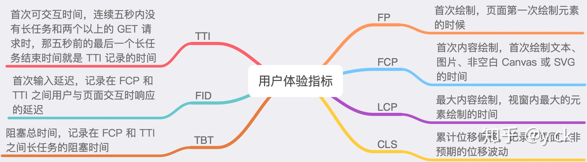
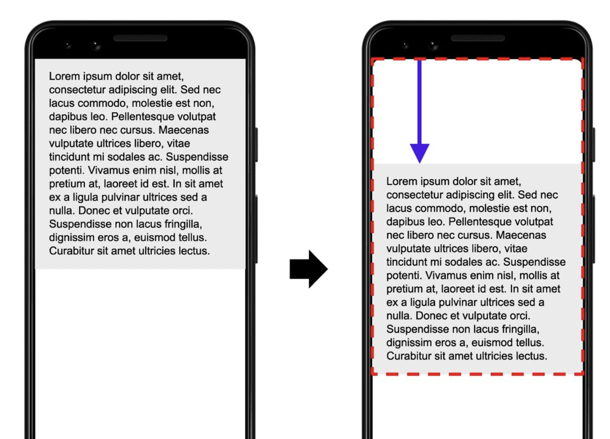

# Web性能监控

2021 年 11 月 1 日 徐千涵

## 1. 性能监控的必要性

- 转换率: 即用户完成目标操作的比率。页面加载时间减少几毫秒，都会增加转化率。
- 跳出率：网页加载时长每增加 1 秒，用户就会流失 10%；一个移动端页面加载时长超过 3 秒，用户就会放弃而离开。

## 2. 监控指标

- RAIL 模型: 以用户为中心
    - Response: 100ms内响应用户输入
    - Animation: 动画或滚动需在10ms内产生下一帧
    - Idle: 最大化主线程的空闲时间
    - Load: 页面加载时长不超过 5 秒
- 核心指标
  
    
    
    - LCP(最大内容绘制): 代表了页面的速度指标
        - 指标实时更新，数据更精确
        - 代表着页面最大元素的渲染时间，而页面中最大元素的快速载入能最大程度地决定用户体验
    - TBT(阻塞总时间): 记录在 FCP 到 TTI 之间的时间间隔，这个指标反映了用户的交互是否能及时响应
        - 长任务: 主线执行的任务所需的时长超过 50ms
        - 每个长任务的阻塞时间等于执行时间减去 50 ms，加总即为TBT
    - CLS (累计位移偏移): 代表了页面的视觉呈现是否保持稳定
        - 使用 CLS（Cumulative Layout Shift）即累计布局位移进行评估，通过比较单个元素在帧与帧之间的位置偏移来计算。
        - 计算公式: `cls = impact fraction * distance fraction` = 75%(红框占视窗比例) * 25%(蓝色箭头的偏移比例) = 0.1875
        
        
        

## 3. 合成监控 - Lighthouse

- 合成监控: 采用 web 浏览器模拟器来加载网页，通过模拟终端用户可能的操作来采集对应的性能指标，最后输出一个网站性能报告
- Lighthouse: Google开源自动化工具
    - 安装: [Chrome扩展下载](https://chrome.google.com/webstore/detail/lighthouse/blipmdconlkpinefehnmjammfjpmpbjk?hl=zh-cn)

> 案例: XIAOHUI官网
> 
> 
> 问题①: **「Serve images in next-gen formats 」图片使用下一代编码格式**
> 
> - 建议使用WebP和AVIF代替PNG或JPEG
> - 何为[WebP](https://www.techug.com/post/bi-webp-2.html): 一种旨在加快图片加载速度的图片格式。图片压缩体积大约只有JPEG的2/3，并能节省大量的服务器宽带资源和数据空间。
> - 缺点: 需要考虑兼容性
>     - 解决方案: 纯手动多写一个webp格式的背景图样式/scss配置等
> 
> 问题②:  **「Enable text compression 」文字资源压缩**
> 
> - 开启gzip:
>     - 能将输出到用户浏览器的数据进行压缩处理，减小通过网络传输的数据量，提高浏览的速度
> - 步骤
>     1. 安装依赖 `npm install --save-dev compression-webpack-plugin` 
>     2. 在nginx中开启gzip并进行配置
> 
> 问题③: **「Links to cross-origin destinations are unsafe」 不安全的跨源链接**
> 
> - 解决方案: 添加 `rel="noopener"` or `rel="noreferrer"`
> - 风险: 链接到的网站可以使用window.opener该JS属性更改原始页面以窃取信息并传播恶意代码
> - `rel=“noopener”`会阻止新标签利用window.opener
> - `rel=“noreferrer”`可防止将引用者信息传递给新标签

- 📢 **Lighthouse的局限性**: 基于Lighthouse为性能测试工具，并不能完全代表用户的真实体验。还需要进行真实环境的性能指标收集和分析

## Reference

[使用 Lighthouse 分析前端性能](https://zhuanlan.zhihu.com/p/376925215)