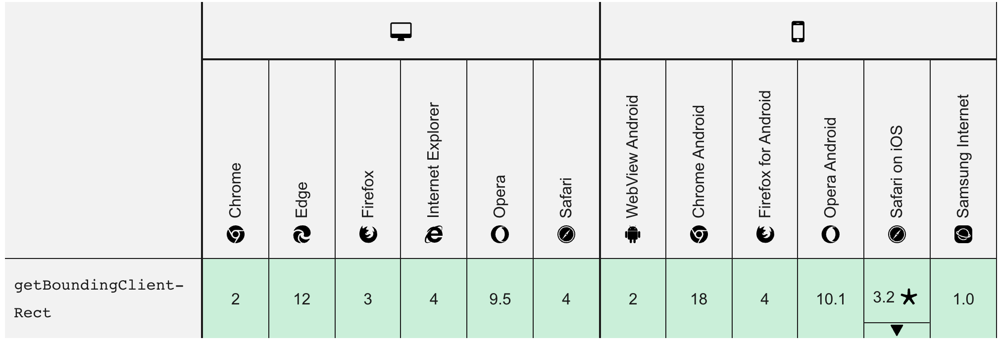
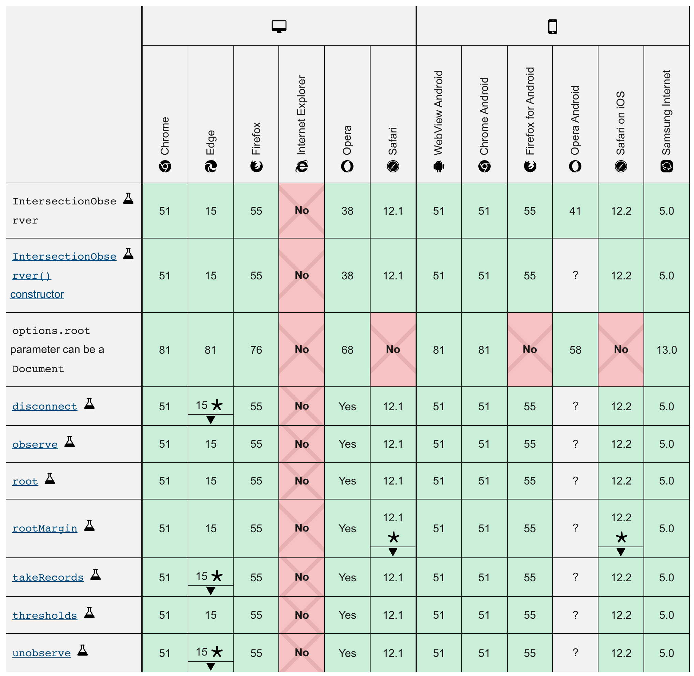
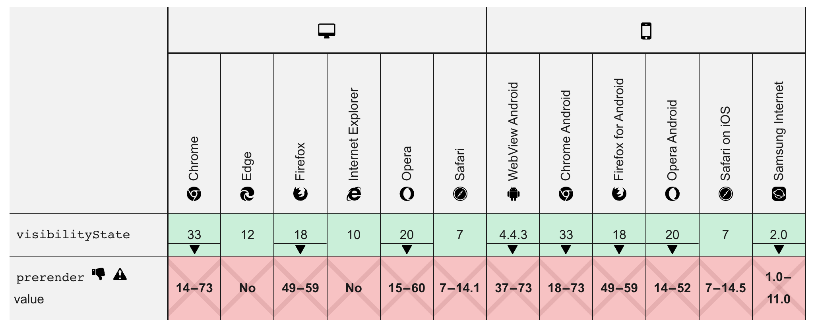

# 可见性

2021年11月8日 李金星

## 需求场景

网页开发时，我们常需要了解某个元素是否进入了可视窗口(viewport)，即用户是否可以看到该元素


一些常见应用案例：

#### 惰性加载 (lazy load)

对于资源加载，有时需要用户向下滚动，dom进入视口时开始加载，这样可以节省带宽，也可加快首屏渲染速度

#### 无限滚动 (infinite scroll)

页面底部有一个页尾栏(sentinels)。一旦页尾栏可见，表示用户到达了页面底部，从而加载新的资源放在页尾栏前


## DOM可见性

### 计算方式

#### 方法1 DOM递归

```js
const getTop = (dom) => {
  let offset = dom.offset
  if(dom.offsetParent) {
    offset += getTop(dom.offsetParent)
  }
  return offset
}
```

缺点：需要遍历DOM树，消耗浏览器性能。


#### 方法2 getBoundingClientRect()

[MDN doc](https://developer.mozilla.org/en-US/docs/Web/API/Element/getBoundingClientRect)

```js
const dom = dom.getBoundingClientRect()
```


优点：便于计算DOM位置

缺点：若用于计算元素可见性，需要监听scroll事件，并持续计算；众所周知的是scroll事件对性能有较大消耗:(

#### 兼容性 · 全兼容




### 方法3 IntersectionObserver

[MDN doc](https://developer.mozilla.org/zh-CN/docs/Web/API/Intersection_Observer_API)

针对上述两种需要手动计算DOM位置所带来的性能消耗，`IntersectionObserver`则可以实时提供dom位置相关数据，并针对不同可见域提供相应回调函数。

```js
const io = new IntersectionObserver(callback,option)

//start observer
io.observe(dom)

//stop observer
io.unobserve(dom)

//close observer
io.disconnect()
```

##### @params: callback

callback的参数entries是一个数组，每个 成员都是一个`IntersectionObserverEntry`对象。(若同时有两个被观察对象可见性发生变化，则entries数组有两个成员)

`IntersectionObserverEntry`提供目标元素信息，共六个属性

- time：可见性发生变化的时间，是一个高精度时间戳，单位为毫秒
- target：被观察的目标元素，是一个 DOM 节点对象
- rootBounds：根元素的矩形区域的信息，getBoundingClientRect()方法的返回值，如果没有根元素（即直接相对于视口滚动），则返回null
- boundingClientRect：目标元素的矩形区域的信息
- intersectionRect：目标元素与视口（或根元素）的交叉区域的信息
- intersectionRatio：目标元素的可见比例，即intersectionRect占boundingClientRect的比例，完全可见时为1，完全不可见时小于等于0

##### @params: option

###### threshold属性

threshold决定了什么时候触发回调函数。该属性是一个数组，每个元素是一个阈值，默认为[0]，即交叉比例(intersectionRatio)达到0时(元素不可见时)触发回调函数

用户可以自定义这个数组，如[0,0.5,1]就表示目标元素0%,50%,100%可见时，分别触发一次回调函数

#### 兼容性 · 除IE外均良好




## 页面可见性

上述DOM可见性提供了单页面内滚动/切换事件带来的解决方案。

但对于页面`选项卡切换`/`页面最小化`情况，可以考虑集成在document属性上的可见性API进行操作。页面可见性 API文档何时可见/隐藏，以及查看页面当前可见性状态的功能。


### Page Visibility API

是一个页面可见性API，浏览器标签页被隐藏或显示的时候会触发 `visibilitychange`事件。

这是 `HTML5` 新提供的一个 `api` ，作用是记录当前标签页在浏览器中的激活状态。 所谓“激活状态”指当前标签是否正在被用户浏览。

我们知道，平时在 `PC` 端浏览网页的时候，使用的都是选项卡这种方式浏览网页，使用这种方式浏览，任何给定网页都有可能在后台，因此对用户不可见。页面可见性 `API` 提供了开发者可以观察的事件，以便了解文档何时可见或隐藏，以及查看页面当前可见性状态的功能。

页面可见性 `API` 对于节省资源和提到性能特别有用，它使页面在文档不可见时避免执行不必要的任务。

当用户最小化窗口或切换到另一个选项卡时，API会发送 `visibilitychange` 事件，让开发者知道页面状态已更改。你可以检测事件并执行某些操作或行为。例如，如果你的网络应用正在播放视频，则可以在用户将标签放入背景时暂停视频，并在用户返回标签时恢复播放。 用户不会在视频中丢失位置，视频的音轨不会干扰新前景选项卡中的音频，并且用户在此期间不会错过任何视频。这种体验是用户无感知的，并且对于用户体验是非常友好的。

规范的使用这个API可以减少对用户宽带的占用，减少服务器压力，节省用户内存，以及到达更好的播放效果。


### 使用方式

- `Document.hidden` 只读属性 布尔值 表示标签页显示/隐藏

- `Document.visibilityState` 只读属性

  - `visible` : 页面至少部分可见，意味着页面是**非最小化窗口**的前景选项卡。
  - `hidden` : 页面对用户不可见，意味着文档在**后台/最小化窗口/操作系统锁屏激活**。
  - `prerender` : 页面内容正在被预渲染且对用户是不可见的(此时 `document.hidden==true`)。文档只有初始状态可能为 `prerender`，但绝不会从其它值转为该值。 
  - `unloaded` : 页面正在从内存中卸载。

- [visibilitychange](https://developer.mozilla.org/en-US/docs/Web/API/Document/visibilitychange_event) 用户最小化窗口/切换至另一选项卡时 触发该事件

  我们可以在 `document` 对象上注册一个监听 `visibilitychange` 事件，根据 `document.hidden` 或者 `document.visibilityState` 属性做一些业务逻辑。

  ```js
  function onVisibilityChange() {
    if (!document[this.hiddenProperty]) {
      console.log('页面显示');
    } else {
      console.log('页面隐藏');
    }
  }
  
  function addVisibilityListener() {
    // 兼容性处理
    const hiddenProperty = 'hidden' in document ? 'hidden' : 'webkitHidden' in document ? 'webkitHidden' : 'mozHidden' in document ? 'mozHidden' : null;
    const visibilityChangeEvent = hiddenProperty.replace(/hidden/i, 'visibilitychange');
    document.addEventListener(visibilityChangeEvent, onVisibilityChange, false);
  }
  
  function removeVisilityListener() {
    const hiddenProperty = 'hidden' in document ? 'hidden' : 'webkitHidden' in document ? 'webkitHidden' : 'mozHidden' in document ? 'mozHidden' : null;
    const visibilityChangeEvent = hiddenProperty.replace(/hidden/i, 'visibilitychange');
    document.removeEventListener(visibilityChangeEvent, onVisibilityChange, false);
  }
  
  ```

  

### 使用场景

- 轮播 - 网站有图片轮播效果，只有在用户来到当前页面，观看轮播的时候，才会自动展示下一张幻灯片。
- 信息仪表 - 显示信息仪表盘的应用程序不希望在页面不可见时轮询服务器进行更新。
- 浏览量计算 - 页面想要检测是否正在渲染，以便可以准确的计算网页浏览量
- 待机 - 当设备进入待机模式时，网站想要关闭设备声音（用户按下电源键关闭屏幕）

### 兼容性良好




##### 参考文档

[页面可见性API](https://developer.mozilla.org/zh-CN/docs/Web/API/Page_Visibility_API)