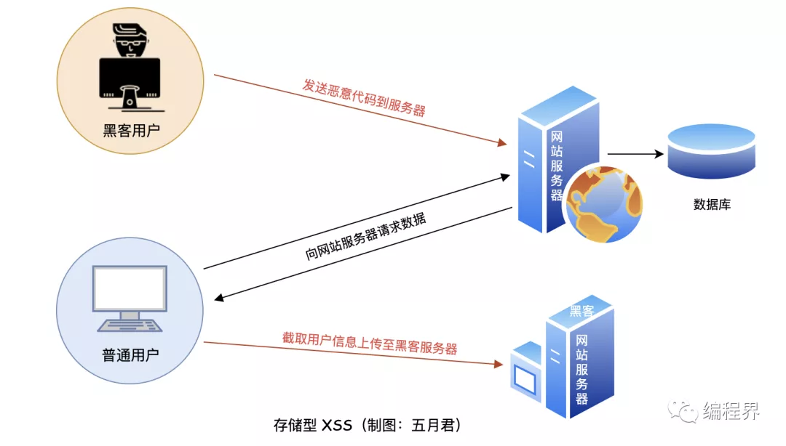
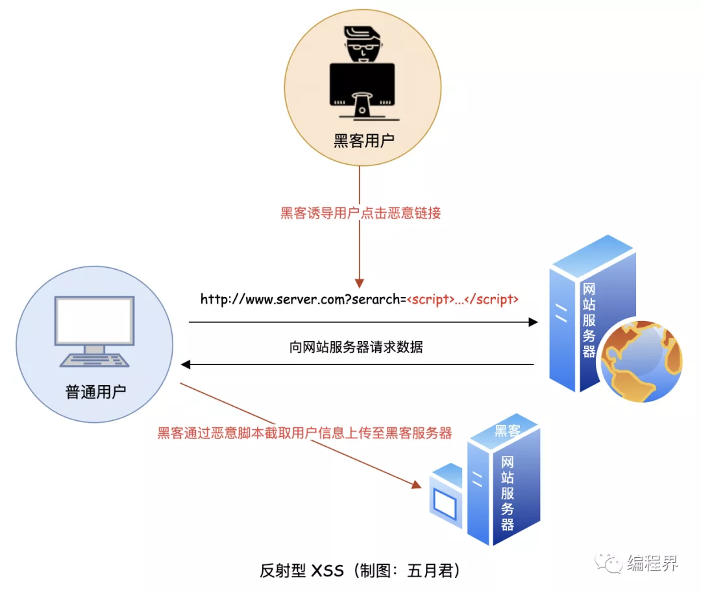
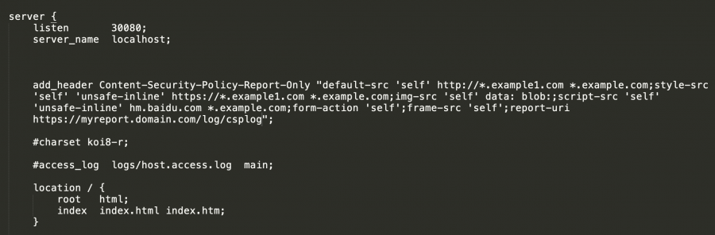
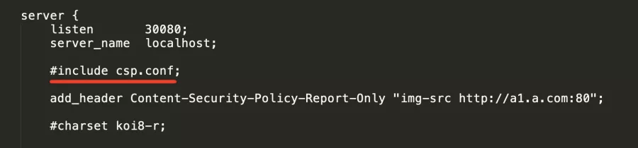
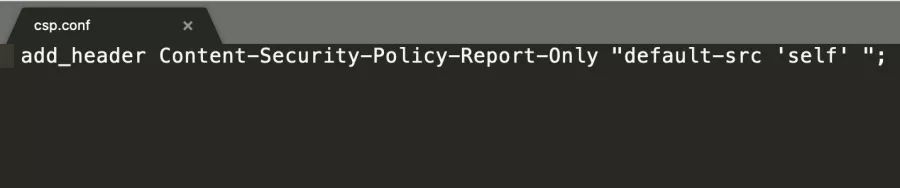

# Web 安全: 跨站脚本攻击 XSS

2021 年 11 月 29 日 徐千涵

# XSS(Cross Site Scripting)

- XSS 是一种代码注入方式的跨站脚本攻击。
- 黑客往 HTML、DOM 中插入了网站没有校验的恶意脚本，当用户浏览时，浏览器无法确认这些脚本是正常的还是注入的页面内容。
- 当执行到这些恶意脚本时就会对用户进行 cookie 窃取、监听用户行为收集信息发往黑客服务器、会话劫持和修改页面 DOM 恶意攻击等

## 存储型 XSS 攻击

- 常见于带有用户保存数据的网站功能，如论坛发帖、商品评论、用户私信等。
- 攻击步骤:
  1. 攻击者将恶意代码提交到目标网站的数据库中。
  2. 用户打开目标网站时，网站服务端将恶意代码从数据库取出，拼接在 HTML 中返回给浏览器。
  3. 用户浏览器接收到响应后解析执行，混在其中的恶意代码也被执行。
  4. 恶意代码窃取用户数据并发送到攻击者的网站，或者冒充用户的行为，调用目标网站接口执行攻击者指定的操作。



## 反射型 XSS 攻击

- 常见于通过 URL 传递参数的功能，如网站搜索、跳转等，由于需要用户主动打开恶意的 URL 才能生效，攻击者往往会结合多种手段诱导用户点击。
- 攻击步骤:
  1. 攻击者构造出特殊的 URL，其中包含恶意代码。
  2. 用户打开带有恶意代码的 URL 时，网站服务端将恶意代码从 URL 中取出，拼接在 HTML 中返回给浏览器。
  3. 用户浏览器接收到响应后解析执行，混在其中的恶意代码也被执行。
  4. 恶意代码窃取用户数据并发送到攻击者的网站，或者冒充用户的行为，调用目标网站接口执行攻击者指定的操作。



## 基于 DOM 的 XSS 攻击

- 攻击步骤:
  1. 攻击者构造出特殊的 URL，其中包含恶意代码。
  2. 用户打开带有恶意代码的 URL。
  3. 用户浏览器接收到响应后解析执行，前端 JavaScript 取出 URL 中的恶意代码并执行。
  4. 恶意代码窃取用户数据并发送到攻击者的网站，或者冒充用户的行为，调用目标网站接口执行攻击者指定的操作。
- 攻击不涉及网站服务器，通常是由于前端页面不严谨的代码产生的安全漏洞，导致注入了恶意代码。
- 例如，在使用  `.innerHTML`、`document.write()`、`document.outerHTML`  这些能够修改页面结构的 API 时要注意防范恶意代码，尽量使用  `.textContent`、`.setAttribute()`  等。

# 内容安全策略(CSP)

- CSP 策略由多个 `指令：来源`组成，指令是使白名单生效的标签，来源是规定浏览器可以执行的脚本（即 js 文件等）、页面资源（如图片、字体等）的来源白名单。
- `img-src 'self'` 中，img-src 即为指令，意味后面的配置对标签中 src 属性生效，‘self'为来源，规定中的 src 属性只允许包含与当前页面地址同源（同协议、同域名、同端口）的链接。
- CSP 的实质为白名单制度，开发者明确告诉客户端，哪些外部资源可以加载和执行，没有被加入白名单的来源会被浏览器拒绝访问。它的实现和执行全部由浏览器完成，开发者只需提供配置。

| 指令        | 含义                                                                                                                                                   |
| ----------- | ------------------------------------------------------------------------------------------------------------------------------------------------------ |
| default-src | 用于其他大部分指令的后备指令，即在未检测到最相关的"指令"时，按照 default-src 的规则生效                                                                |
| font-src    | 字体资源来源                                                                                                                                           |
| report-uri  | 浏览器根据 CSP 策略阻拦了资源的加载时会生成一个报告，会向 report-uri 指定的地址发送一个 post 请求。\*\*<meta>标签中配置的 CSP 无法使用 report-uri 指令 |
| script-src  | 脚本来源                                                                                                                                               |
| form-action | 表单的提交地址，该指令不会回退到 default-src                                                                                                           |
| frame-src   | 页面嵌套来源                                                                                                                                           |
| media-src   | 媒体资源来源                                                                                                                                           |
| style-src   | 样式表资源来源                                                                                                                                         |
| img-src     | 图片资源来源                                                                                                                                           |
| connect-src | 限制可以使用脚本接口加载的 URL，如使用 xhr 等                                                                                                          |

由于 CSP 策略由浏览器自行实现，因此会出现某种浏览器对某些[指令](https://developer.mozilla.org/en-US/docs/Web/HTTP/Headers/Content-Security-Policy)不支持的情况，如无必要，只使用最基本、最常用的指令就好。

| 'self'                 | 允许同源的资源引入                                                              |
| ---------------------- | ------------------------------------------------------------------------------- |
| 'none'                 | 不允许引入任何资源，不允许调用任何脚本                                          |
| \*.example.com         | 允许根域名为 example.com 的域名                                                 |
| \*                     | 允许任意的来源（但不包含其他协议、’unsafe-inline'、'unsafe-eval'等）            |
| ftp:                   | 允许 ftp 协议，其他协议类似，如 http,https 等                                   |
| data:                  | 允许使用 data:伪协议，一般指数据的引入方式，类似的配置（伪协议）还有如 blob: 等 |
| 'unsafe-eval'          | 允许使用 eval()函数执行脚本                                                     |
| 'unsafe-inline'        | 允许网页内联资源（见下文详细配置说明）                                          |
| 121.122.123.124        | 允许从 121.122.123.124 引入资源，ip 似乎无法使用通配符                          |
| www.example.com:8080   | 允许www.example.com，8080端口                                                   |
| http://www.example.com | 允许协议为 http，域名为www.example.com                                          |

## 基本配置方法

### 通过 meta 标签配置 CSP 策略

```jsx
<meta http-equiv="Content-Security-Policy" content="default-src 'self'">
```

- 这种方式配置 CSP 策略无法使用 report-uri，因此无法监控 CSP 的运行状态（比如是否阻止了不应该阻止的资源），有可能在测试环境中 CSP 策略运行的很完美，但到了线上环境却出现了各种问题。只适合在本地测试 CSP 策略时使用这种方式。

### 将 CSP 策略配置在响应头中

1. 在前端 Nginx 的配置中，以增加响应头的方式配置 CSP 策略



(实际上通过 include 引入文件的方式可能会更方便一些，不需要每次都修改 nginx.conf 文件了，直接替换引入的文件即可)





1. 在其他中间件的配置中增加 CSP 策略

   e.g. Apache: 在 VirtualHost 的 httpd.conf 文件或者.htaccess 文件中加入以下代码

   ```jsx
   Header set Content-Security-Policy "default-src 'self';"
   ```

## CSP 策略的缺陷

### 浏览器兼容性问题

- CSP 策略最终作用于用户的浏览器，且不同浏览器实现 CSP 的方式与标准并不完全统一，各浏览器对 CSP 的实现也在不断地更新。因此，假如用户使用了非主流的浏览器内核或其旧版本，可能会存在不支持 CSP 策略的情况。 [可参考网页](https://caniuse.com/#feat=contentsecuritypolicy)

### 流量劫持

- 利用各种恶意软件修改浏览器、锁定主页或不停弹出新窗口，强制网络用户访问某些网站，从而造成**用户流量**被迫流向特定网页的情形。
- CSP 策略能够一定程度上防止流量劫持问题，但对于有针对性的劫持，可能无法完美防御。
- 推荐联合防御策略:
  1. 使用 HTTPS(HTTP 协议没有办法对通信对方的身份进行校验以及对数据完整性进行校验)
  2. 使用 CSP 策略
  3. 对于重要页面，可以在客户端校验前端代码，如有不一致则向服务器发送一封报告，方便进行原因排查

## 小游戏

[XSS Game](https://xss-game.appspot.com/level1)
